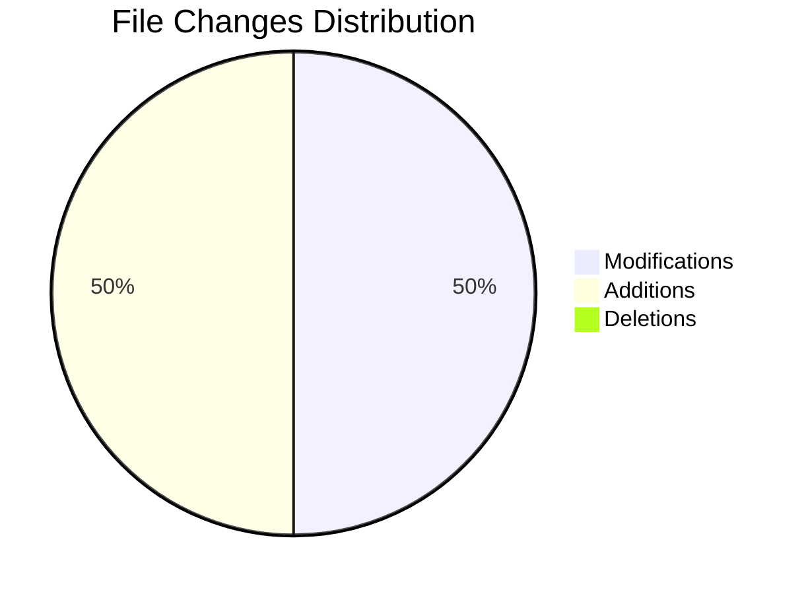

# 🎮 _css Change Log


Productivity Metrics:
-------------------
Time Spent: 28 minutes
Lines Added: 20
Lines Deleted: 0
Net Lines Changed: 20
Code Velocity: 42 lines/hour
Coding Consistency: Average 6 seconds between edits
Total Edits: 367

## 📊 Change Summary

| Metric | Count |
|--------|--------|
| 📝 Files Modified | 1 |
| ➕ Files Added | 1 |
| 🗑️ Files Deleted | 0 |

## 🔍 Detailed Changes

### .gitignore (Added ✨)

```javascript
.pathos/```

### estilo.css (Modified)
25 additions, 1 deletions

```
+ @charset "UTF-8";
+ 
+ body {
+        background-color: white;
+        color: rgba(0, 0, 0, 1);
+     
+ }
+ p { 
+     text-align: justify;
+     text-indent: 50px;
// ...
```


## 📈 Visual Representation



## 📊 Changes Overview
```
📈 Additions:    █████████████████████████████░ +26
📉 Deletions:    █░░░░░░░░░░░░░░░░░░░░░░░░░░░░░ -1
```

## 🛠️ Technical Details
- **Project**: _css
- **Timestamp**: Apr 25, 2025, 07:24 PM
- **Type**: Feature Addition
- **Impact**: Low

---

<details>
<summary>📝 Note</summary>
This changelog was automatically generated by Pathos. For more detailed information, please check the commit history.
</details>

---

*Generated on Apr 25, 2025, 07:24 PM*

[](https://github.com/dipandhali2021/pathos)
