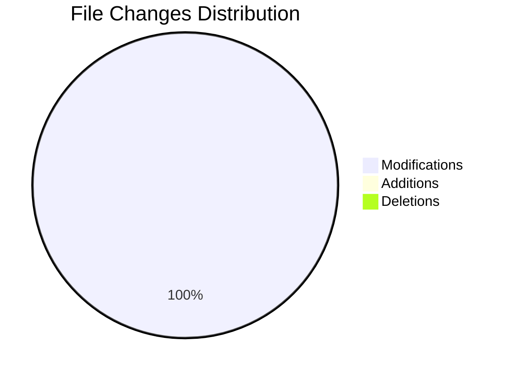

# 🎮 Jv Change Log


Productivity Metrics:
-------------------
Time Spent: 4 minutes
Lines Added: 5
Lines Deleted: 3
Net Lines Changed: 2
Code Velocity: 29 lines/hour
Coding Consistency: Average 3 seconds between edits
Total Edits: 77

## 📊 Change Summary

| Metric | Count |
|--------|--------|
| 📝 Files Modified | 1 |
| ➕ Files Added | 0 |
| 🗑️ Files Deleted | 0 |

## 🔍 Detailed Changes

### ex004 (Modified)
2 additions, 0 deletions

```
+         document.write(`Seu nome em maíusculo é ${nome.toUpperCase()}.<br/>`)
+         document.write(`Seu nome em minúsculo é ${nome.toLowerCase()}.`)
```


## 📈 Visual Representation



## 📊 Changes Overview
```
📈 Additions:    ██████████████████████████████ +2
📉 Deletions:    ░░░░░░░░░░░░░░░░░░░░░░░░░░░░░░ -0
```

## 🛠️ Technical Details
- **Project**: Jv
- **Timestamp**: May 8, 2025, 07:07 PM
- **Type**: Feature Addition
- **Impact**: Low

---

<details>
<summary>📝 Note</summary>
This changelog was automatically generated by Pathos. For more detailed information, please check the commit history.
</details>

---

*Generated on May 8, 2025, 07:07 PM*

[](https://github.com/dipandhali2021/pathos)
